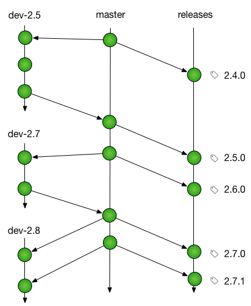

# NCEAS development notes

Considerations on approaches to reorganizing ouor development workflow to learn from Git-Flow and
other models.  One approach:

- Main development occurs on ‘master’, which is beta-level stable
    - Code that is merged to master is considered ready for release (fully developed and tested), so that the release manager can cut a release at any time of the features that have already been merged to master
- Unstable code is developed in feature branches
- Pull requests are issued against master
    - Merging pull requests should consider whether it is ready for release before merging the pull request.  If not, a request can be made to retarget the pull request against a feature branch

- Releases are merged from master to ‘releases’ and tagged
    - Releases are named using semantic versioning (e.g., 1.1.1)
- Patch release branches are created from release tags as needed
- Patch releases are tagged on patch release branches
     - Merging or reapplying changes are both ok on patch release branches

